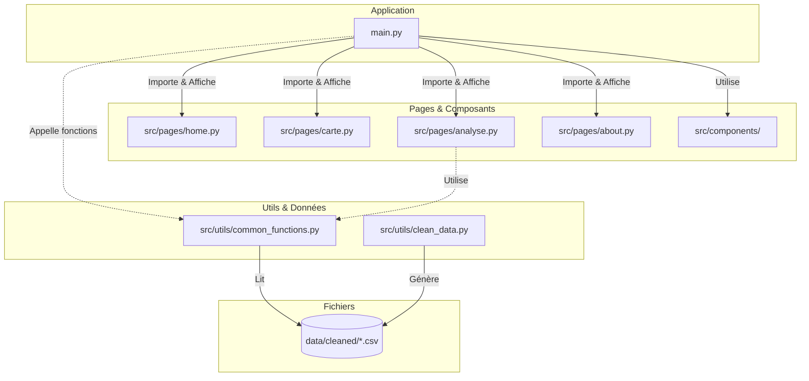

# Dashboard Football - Projet Multidisciplinaire E3-FI

Ce projet est un dashboard interactif réalisé dans le cadre du cours de Projet Multidisciplinaire en école d'ingénieur. Il permet d'analyser et de comparer les performances des 5 grands championnats européens de football pour la saison 2024-2025.

---

## 1. User Guide

Cette section explique comment installer et utiliser le dashboard sur votre machine.

### Prérequis
- **Python 3.8** ou supérieur doit être installé.
- Une connexion internet (pour l'installation des paquets).

### Installation et Démarrage

1. **Cloner le projet** (ou extraire l'archive) :
   ```bash
   git clone <url_du_repo>
   cd data_project
   ```

2. **Installer les dépendances** :
   Il est recommandé d'utiliser un environnement virtuel.
   ```bash
   pip install -r requirements.txt
   ```

3. **Lancer l'application** :
   ```bash
   python main.py
   ```

4. **Accéder au dashboard** :
   Ouvrez votre navigateur web et allez à l'adresse suivante :
   [http://127.0.0.1:8050](http://127.0.0.1:8050)

### Utilisation
- **Sélecteur de Ligue** : En haut du dashboard, choisissez le championnat que vous souhaitez analyser (Ligue 1, Premier League, Bundesliga, etc.).
- **Navigation** : Utilisez les onglets pour basculer entre les différentes vues :
  - *Accueil* : Présentation globale.
  - *Carte* : Visualisation géographique des stades.
  - *Analyse* : Classements détaillés et graphiques de performance.
  - *À propos* : Informations sur le projet.

---

## 2. Data

Les données utilisées pour ce projet concernent la saison 2024-2025.

### Provenance et Contenu
Les données proviennent du projet **Open Football** ([http://openfootball.github.io](http://openfootball.github.io)), qui répertorie des milliers de données sur le football.
Elles couvrent les 5 ligues majeures :
- **France** : Ligue 1
- **Angleterre** : Premier League
- **Allemagne** : Bundesliga
- **Espagne** : La Liga
- **Italie** : Serie A

### Structure des données
Les fichiers sont organisés dans le dossier `data/` :
- **`data/raw/`** : Contient les fichiers bruts (JSON/CSV) extraits via scraping ou API.
- **`data/cleaned/`** : Contient les données nettoyées et prêtes à l'emploi :
  - `matchs_*.csv` : Historique des rencontres avec scores et dates.
  - `statistiques_*.csv` : Classements agrégés par équipe.
  - `locations_stades_nettoyes.csv` : Coordonnées GPS et capacités des stades.

---

## 3. Developer Guide

Cette section détaille l'architecture technique pour faciliter la maintenance et l'évolution du projet.

### Architecture du Code
Le projet suit une structure modulaire. L'architecture ci-dessous illustre l'approche impérative où le programme principal orchestre les appels aux différentes vues et fonctions de données.



### Comment ajouter une nouvelle page ?
1.  Créer un fichier `ma_nouvelle_page.py` dans `src/pages/`.
2.  Définir une variable `layout` contenant les composants Dash (html.Div, etc.).
3.  Dans `main.py`, importer la page : `import src.pages.ma_nouvelle_page as ma_page`.
4.  Ajouter une condition dans le callback de routing pour afficher `ma_page.layout`.

### Comment ajouter un graphique ?
1.  **Préparation des données** : Ajoutez une fonction de calcul dans `src/utils/common_functions.py` qui retourne un DataFrame ou une liste formatée.
2.  **Vue** : Dans le fichier de page concerné (ex: `src/pages/analyse.py`), ajoutez un composant `dcc.Graph(id='mon-nouveau-graph')`.
3.  **Logique** : Dans `main.py`, ajoutez un callback (ou modifiez l'existant) qui prend les inputs nécessaires (ex: la ligue sélectionnée) et retourne la figure Plotly construite à partir de vos données.

---

## 4. Rapport d'analyse

L'exploration des données via le dashboard permet de dégager plusieurs tendances sur le football européen actuel.

### Conclusions principales

1.  **Avantage du Domicile** :
    L'analyse des performances Domicile vs Extérieur confirme une tendance historique du football : les équipes marquent systématiquement plus de points et de buts dans leur propre stade. Cet écart est particulièrement visible dans les ligues très denses comme la Premier League.

2.  **Disparité des Capacités (Stades)** :
    La carte interactive révèle des différences d'infrastructures notables. L'Allemagne (Bundesliga) et l'Angleterre disposent en moyenne de stades à plus forte capacité répartis sur tout le territoire, tandis que d'autres ligues montrent une plus forte concentration de grands stades uniquement dans les métropoles majeures.

3.  **Densité de buts** :
    Le graphique des "Buts par journée" permet de comparer le spectacle offert. On observe souvent que la Bundesliga offre une moyenne de buts par match supérieure, témoignant d'un style de jeu plus offensif comparé à des ligues plus tactiques comme la Serie A.

4.  **Hiérarchie des équipes** :
    Les classements montrent que dans la plupart des championnats, un groupe restreint de 3-4 équipes se détache rapidement en tête (le "Top 4"), creusant un écart significatif de points avec le milieu de tableau dès la mi-saison.

---

### Auteurs
Projet réalisé par **Rémy Kouniali** et **Noé Lautridou**.

---

## 5. Copyright

Je déclare sur l’honneur que le code fourni a été produit par nous-mêmes, à l’exception des éléments ci-dessous :

- **Fichier README.md** : La rédaction de ce fichier a été assistée par une IA afin de gagner du temps et d'améliorer la visibilité du projet. Notamment le schéma mermaid


